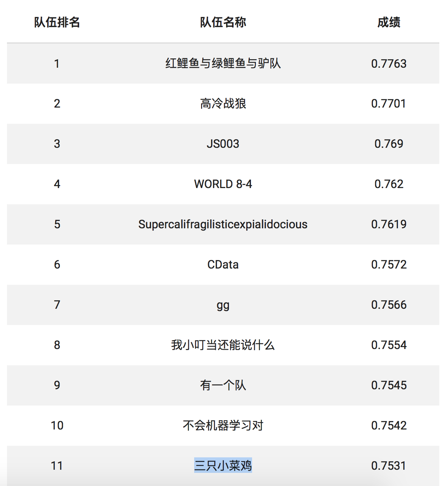

# SeedCup2017

种子杯2017.10初赛题解 by 三只小菜鸡

### 题目简述

通过球队成员的各项数据（上场时间、投篮命中率等）和互相比赛的两个球队的历史战绩，预测主场取得胜利的置信度。

### 解题思路

分析特征，使用机器学习将比赛的两个球队分类，并输出各类的置信度。详细思路请参考 pdf 文件。

### 成果

交叉测试中，分类准确率达到 73%。提交后 AUC 值最高达到 0.7531。

### 排名

截止到初赛提交的最后时刻，排行榜的名次为 11 名。总共约 100 只队伍参赛。

最终成绩尚未公布，可能存在变化。